# AI Job Salary Prediction — Global AI Job Market 2025


## Problem Description

Over the last few years, the demand for AI professionals has grown rapidly, but the job market remains opaque for both candidates and employers.  
AI engineers, data scientists, and ML practitioners often struggle to answer simple but important questions:

- What salary can I realistically expect given my skills and experience?
- How much do salaries differ between countries, company sizes, and job titles?
- Do remote roles pay more or less than on-site positions?
- Which combinations of experience level, skills, and location are associated with higher pay?

This project uses the **Global AI Job Market & Salary Trends 2025** dataset from Kaggle, containing realistic synthetic data about AI-related job postings.

### Goal of the Project

> **Predict the expected salary (`salary_usd`) for AI-related roles based on job characteristics and analyze which features have the strongest impact on pay.**

This includes:

- Performing EDA to understand salary patterns across countries, roles, experience levels, and remote ratio.
- Creating a clean ML pipeline for preprocessing and feature engineering.
- Training multiple regression models and selecting the best-performing one based on RMSE.
- Deploying a lightweight prediction API for practical usage.

### Why This Problem Matters

- Helps **candidates** evaluate whether offers are fair.
- Enables **HR teams** to build competitive and data-driven salary ranges.
- Supports **market analysts** in understanding global salary trends.
- Promotes **transparency** in the global AI job market.

---

## Dataset Description

Source: https://www.kaggle.com/datasets/bismasajjad/global-ai-job-market-and-salary-trends-2025

The dataset contains **15,000 AI-related job listings** across multiple countries, roles, and company sizes.

### Columns

| Column Name              | Data Type   | Description                                                                                                 |
|--------------------------|-------------|-------------------------------------------------------------------------------------------------------------|
| `job_id`                 | object      | Unique identifier for each job posting                                                                      |
| `salary_usd`             | float64     | Target variable — annual salary in USD                                                                      |
| `salary_currency`        | object      | Original salary currency before normalization                                                               |
| `experience_level`       | object      | Experience level (EN, MI, SE, EX)                                                                           |
| `employment_type`        | object      | Full-time, part-time, contract, internship                                                                  |
| `company_location`       | object      | Country of the employer                                                                                     |
| `company_size`           | object      | Company size category (S/M/L)                                                                               |
| `employee_residence`     | object      | Employee/resident location                                                                                  |
| `remote_ratio`           | int64       | 0/50/100% remote                                                                                            |
| `required_skills`        | object      | Comma-separated list of required skills                                                                     |
| `education_required`     | object      | Minimum required education level                                                                            |
| `years_experience`       | float64     | Required years of experience                                                                                |
| `industry`               | object      | Industry sector                                                                                             |
| `posting_date`           | object      | Posting date                                                                                                |
| `application_deadline`   | object      | Application deadline                                                                                        |
| `job_description_length` | int64       | Length of job description                                                                                   |
| `benefits_score`         | float64     | Normalized benefits score                                                                                   |
| `company_name`           | object      | Hiring company                                                                                              |

---

## Exploratory Data Analysis (EDA)

### 1. Target Analysis (salary_usd)

The original salary distribution is heavily right-skewed, dominated by high-salary outliers.


To stabilize variance and improve model performance, we apply:

```python
df["target"] = np.log1p(df.salary_usd)
```

This produces a more Gaussian-like distribution, which benefits linear and tree-based models.

### 2. Categorical features

- **job_title** — high cardinality, strong differentiator (e.g., AI Research Scientist > MLE > Data Analyst)
- **company_location** & **employee_residence** — consistent salary variation across regions
- **company_size** — balanced categories (s / m / l)
- **employment_type** — mostly full-time jobs (FT), which aligns with industry expectations
- **salary_currency** — mostly USD; EUR/GBP values were safely handled through log-transform or one-hot encoding.

These categorical columns were encoded using DictVectorizer, which creates a sparse one-hot representation suitable for tree-based models.

### 3. Numerical Features

- **years_experience** — shows meaningful positive correlation with salary
- **remote_ratio** — near-zero correlation, but still included as a potential interaction feature
- **benefits_score** — minimal effect, confirmed via correlation heatmap

Outliers exist, but thanks to log transformation, they do not destabilize the model.

### 4. Top 20 Important Features

Using RandomForestRegressor on the full feature space, we identified the most predictive variables.

<div align="center"> 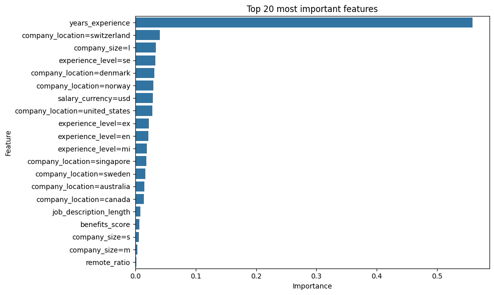 </div>

**Interpretation**:

- Job description content (e.g., keyword-based features) is highly predictive

- Country-specific effects (e.g., Switzerland, Denmark) significantly influence salaries

- Deep technical skills (Python, TensorFlow, PyTorch, Deep Learning) rank among the strongest predictors

- Employment type and company size also contribute meaningfully

This confirms that both job attributes and country effects play central roles in salary prediction.


### 5. Skills Analysis

The required_skills column was parsed into a list of skills.

Top skills include:

- python
- SQL
- tensorflow


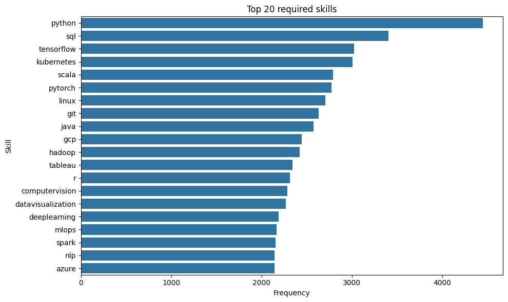


### 6. Missing Values
The dataset not contains missing values.


### 7. EDA Conclusion
The EDA reveals several important insights about the AI job market:

- The salary distribution is highly skewed, and applying a log transformation greatly stabilizes variance.
- Job titles, required skills, and country-level effects are the strongest predictors of salary.
- Numerical variables such as years_experience show meaningful correlation with pay, while others (remote_ratio, benefits_score) contribute only marginally.
- Skills extracted from job descriptions contain high predictive value and significantly enhance the model.
- No major data quality issues were found, and missing values were handled safely.

These findings guided the selection of models, feature engineering approach, and choice of XGBoost as the final model.


## Modeling approach & metrics

The following regression models were trained to evaluate their ability to predict annual salaries in the global AI job market.
Each model serves a different purpose in understanding linearity, interactions, and non-linear patterns within the data.

1. **Linear Regression — Baseline Model**

A simple and interpretable model used as the baseline.
It helps identify whether the dataset exhibits primarily linear relationships.
While fast to train, it underperforms on complex feature interactions.

2. **Decision Tree**

A non-linear model that splits data based on feature thresholds.
Useful for capturing simple patterns, but prone to overfitting and limited in generalization unless heavily regularized.

3. **Random Forest**

An ensemble of multiple decision trees.
It reduces overfitting by averaging predictions across many randomized trees.
Performs significantly better than a single tree and handles high-dimensional one-hot encoded data well.

4. **XGBoost**

An optimized and highly efficient implementation of gradient boosting.
XGBoost handles sparse one-hot encoded data extremely well, allows fine-grained regularization, and consistently outperformed all other models in this project.

### Model Performance & Results

After preparing the dataset, engineering features, and applying log-transformation to the target variable, several regression models were trained and evaluated.
The goal was to compare linear and tree-based methods and identify the most accurate and stable model.

Performance Before Hyperparameter Tuning
| Model             | RMSE (USD)       | R²        |
|-------------------|------------------|-----------|
| Linear Regression | 20800.62         | 0.8804    |
| Decision Tree     | 45729.28         | 0.4219    |
| Random Forest     | 20430.20         | 0.8846    |
| XGBoost           | 20658.42         | 0.8820    |

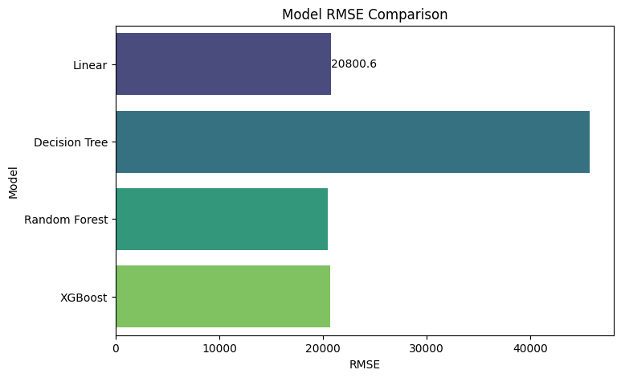

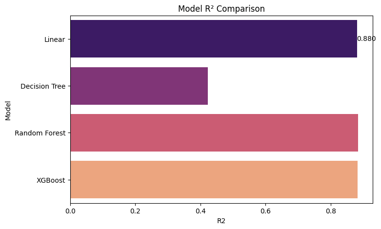

**Interpretation**:

- Linear Regression serves as a strong baseline thanks to the log-transformed target.
- Decision Tree performed poorly due to overfitting and limited ability to generalize.
- Random Forest and XGBoost clearly outperformed the other models.

### Hyperparameter Tuning

To further improve performance, we tuned the two best-performing models:
- Random Forest Regressor
- XGBoost Regressor

| Model                   | RMSE (USD)       | R²        | Best Params                                      |
|-------------------------|------------------|-----------|--------------------------------------------------|
| Random Forest (tuned)   | 20419.90         | 0.8847    | {'max_depth': 20, 'n_estimators': 300}          |
| XGBoost (tuned)         | 20168.66         | 0.8876    | {'learning_rate': 0.05, 'max_depth': 6, 'n_estimators': 500} |


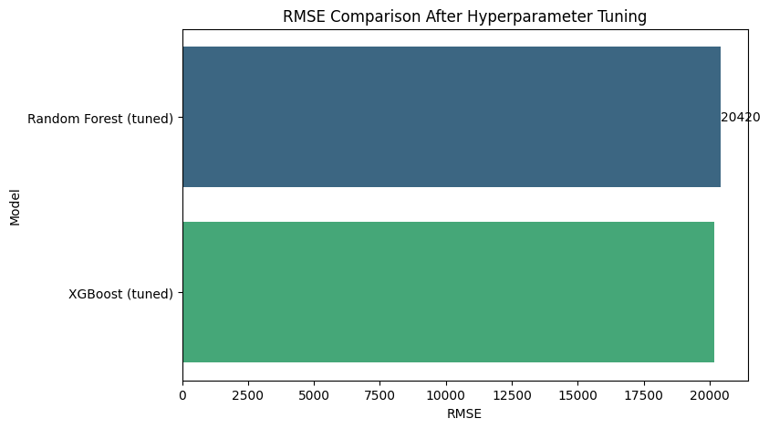


**Interpretation**:

- Tuning provided only marginal improvement for Random Forest, indicating the model was already close to optimal.

- GBoost, however, responded very well to tuning:
 - - RMSE improved by ~500 USD
- - R² increased to 0.8876
- - More stable and consistent across folds


### Final Verdict
XGBoost is the final chosen model for deployment.


## Project Structure 

```
ai_job_salary_predict/
│
├── train.py               # Trains the model and saves model.bin + dv.bin
├── predict.py             # Loads artifacts and performs a sample prediction
├── serve.py               # FastAPI web service exposing /predict and /health
│
├── model.bin              # Trained XGBoost regression model
├── dv.bin                 # DictVectorizer for feature encoding
│
├── requirements.txt       # Python dependencies for local and Docker use
├── Dockerfile             # Containerization setup for the API
│
├── notebook.ipynb         # Full EDA, modeling, tuning, and analysis
├── images/                # All plots and visualizations used in README
│   ├── 001.png
│   ├── 002.png
│   ├── 003.png
│   ├── ...
│
└── README.md              # Project documentation (this file)

```


### From Notebook to Scripts

The original development and experimentation were performed in `notebook.ipynb`.  
For production and reproducibility, the logic was refactored into three scripts:

- **train.py** — loads the dataset, performs preprocessing, trains XGBoost, and saves `model.bin` and `dv.bin`.
- **predict.py** — loads the saved artifacts and performs a single prediction from CLI.
- **serve.py** — exposes the prediction pipeline as a FastAPI web service.

This ensures the project can be reproduced end-to-end without Jupyter.


## How to Run Locally and via Docker

### Run Locally

Clone repo
```
git clone git@github.com:oleksiyo/ai_job_salary_predict.git
```


1. Create virtual environment
```
python3.11 -m venv venv
source venv/bin/activate
```

2. Install dependencies

```
pip install -r requirements.txt
```

3. Start the FastAPI service

```
uvicorn serve:app --reload
```

5. Health check

```
http://127.0.0.1:8000/health

```

Successful response:
```json
{
  "status": "ok"
}
```


### Run with Docker
1. Build the Docker image

```docker
docker build -t ai-salary-api .
```

2. Run the container

```docker
docker run -p 8000:8000 ai-salary-api
```

3. Health check
```
http://localhost:8000/health
```


## API Usage Example
POST /predict

Example request:

```bash
curl -X POST "http://localhost:8000/predict" \
     -H "Content-Type: application/json" \
     -d '{
           "job_title": "Machine Learning Engineer",
           "salary_currency": "USD",
           "years_experience": 5,
           "employment_type": "FT",
           "remote_ratio": 100,
           "company_size": "m",
           "company_location": "US",
           "industry": "IT",
           "required_skills": "python, machine learning, deep learning"
         }'
```

Example response:
```json
{
  "predicted_salary_usd": 119744.14
}
```


## Cloud

1. Install AWS CLI + login:
```
aws configure
```

2. Cerate ECR repository:
```
aws ecr create-repository --repository-name ai-job-model
```

Result:
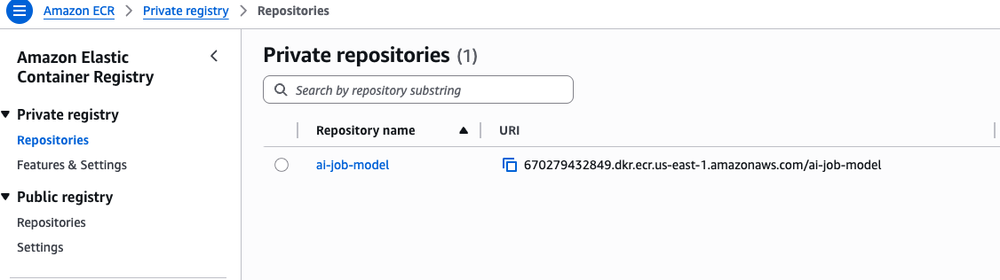


3. Login in ECR:
```
aws ecr get-login-password --region us-east-1 | docker login --username AWS --password-stdin <ECR_ID>.dkr.ecr.us-east-1.amazonaws.com
```

Use ECR_ID from prev step

Result:
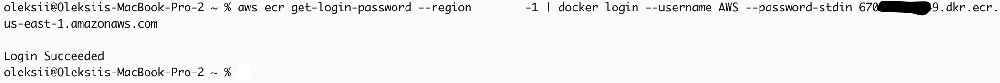


4. Buil Docker:
```
docker build -t ai-job-model .
```

Result:
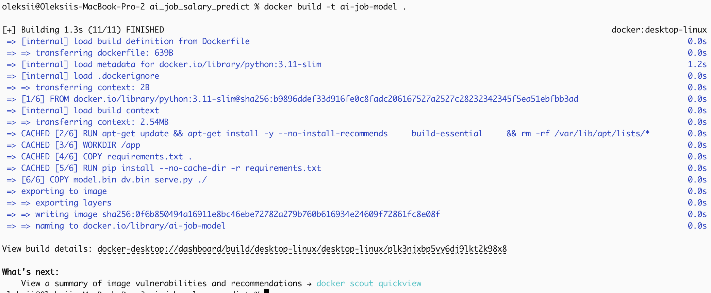


5. Pushing:
```
docker tag ai-job-model:latest <ECR_ID>.dkr.ecr.us-east-1.amazonaws.com/ai-job-model:latest
docker push <ECR_ID>.dkr.ecr.us-east-1.amazonaws.com/ai-job-model:latest
```

Result:
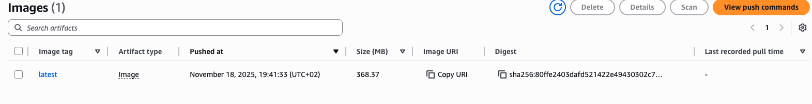


6. Create Lambda from a container:

AWS Console → Lambda → Create function → Container image

Result:
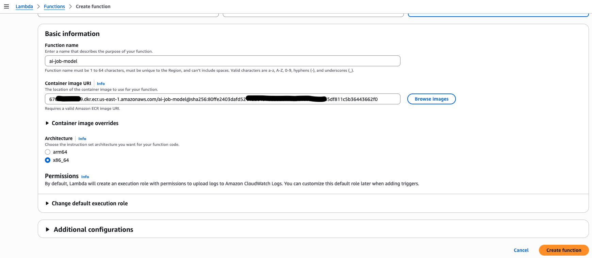

Select an image from ECR


Result:
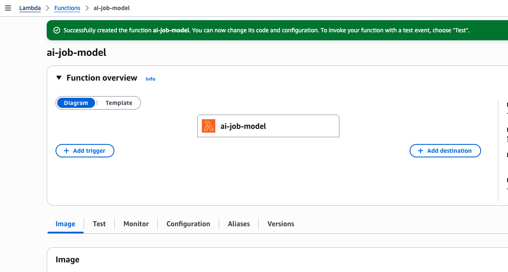


7. Open API Gateway

Go to AWS Console:
https://console.aws.amazon.com/apigateway


7.1. Create API
Select:
API Gateway → APIs

7.2.Select lambda function. (Region should be the same as lambda's)

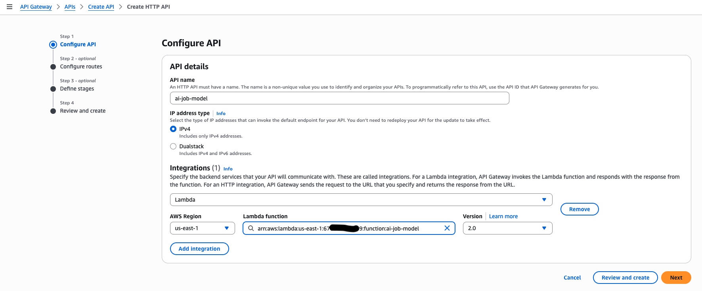

If asked 'Grant API Gateway permission to invoke your Lambda function?' then click Allow


7.3. Create Route

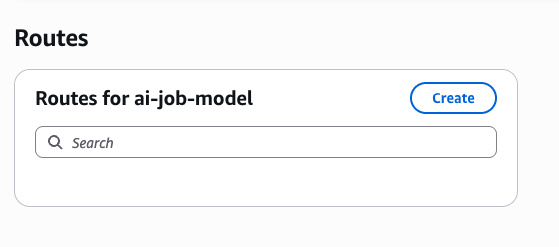


Select 
- Method: POST
- Path: /predict

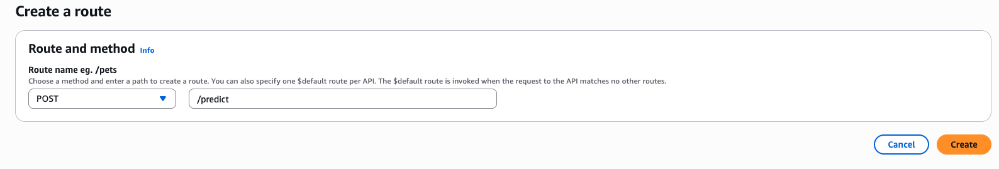

Select: Attach integration → Lambda function 

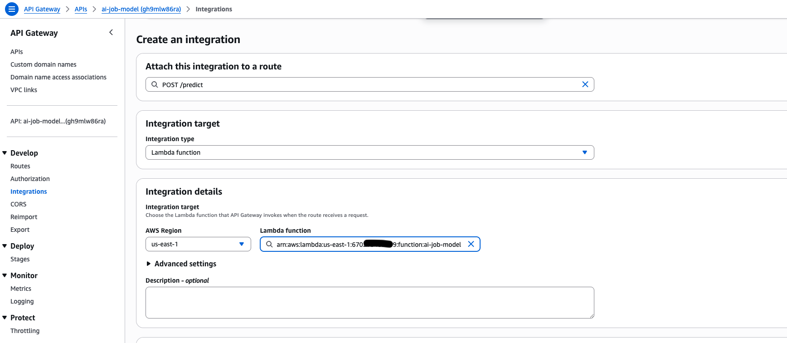

7.4. Deploy

Click on Deploy button.
If need create stage.

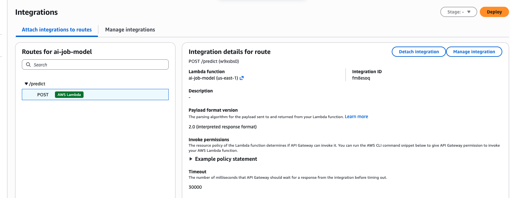


8. Testing

``` curl
curl -X POST \
  -H "Content-Type: application/json" \
  -d '{"job_title": "Machine Learning Engineer",
           "salary_currency": "USD",
           "years_experience": 5,
           "employment_type": "FT",
           "remote_ratio": 100,
           "company_size": "m",
           "company_location": "US",
           "industry": "IT",
           "required_skills": "python, machine learning, deep learning"}' \
  https://<API_ID>.execute-api.us-east-1.amazonaws.com/ai_job_model/predict

```


Example response:
```json
{
  "predicted_salary_usd": 119744.14
}
```


## Next Steps

Despite achieving with the tuned XGBoost model, several opportunities remain to further improve and extend the project:

1. Explore alternative models — compare XGBoost with CatBoost and LightGBM, which natively handle categorical features and may further reduce RMSE.

2. Implement monitoring and drift detection — track model performance over time and detect changes in job market trends or data distribution.

3. Add batch prediction and model metadata endpoints — extend the API with `/predict_batch` and `/model/info` for better usability.

4. Error handler.

5. Auto deploy to cloud.